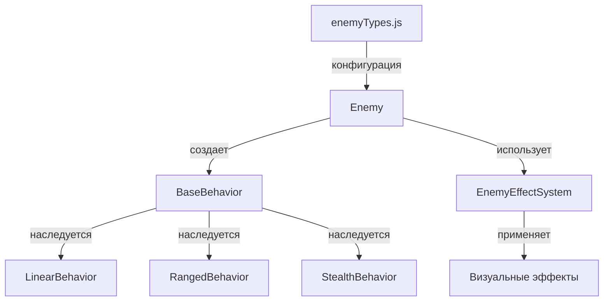

# 🤖 Система поведений врагов (Behavior System)

## 📋 Обзор

Система поведений врагов позволяет создавать уникальное поведение для разных типов врагов, не создавая отдельные классы для каждого врага. Это соответствует принципам проекта и обеспечивает гибкость и расширяемость.

## 🏗️ Архитектура

### Основные компоненты:

```
src/
├── behaviors/
│   ├── BaseBehavior.js      # Базовый класс для всех поведений
│   ├── LinearBehavior.js    # Линейное поведение (существующие враги)
│   ├── RangedBehavior.js    # Дистанционное поведение (оса)
│   └── StealthBehavior.js   # Скрытное поведение (слизень)
├── effects/
│   └── EnemyEffectSystem.js # Система визуальных эффектов
└── objects/
    └── Enemy.js             # Обновленный класс врага с системой поведений
```

### Схема взаимодействия:



## 🎮 Реализованные поведения

### 1. LinearBehavior (Линейное поведение)
- **Используется**: Все существующие враги (муравей, жук, муха, пчела и т.д.)
- **Особенности**: 
  - Плавное движение к цели
  - Сглаженные повороты
  - Стандартная атака в радиусе

### 2. RangedBehavior (Дистанционное поведение)
- **Используется**: Оса
- **Особенности**:
  - Стреляет снарядами из далека
  - Не движется к цели
  - Телепортируется после выстрела
  - Выбирает оптимальные позиции для атаки

### 3. StealthBehavior (Скрытное поведение)
- **Используется**: Слизень
- **Особенности**:
  - 95% прозрачность (альфа 0.05)
  - Становится видимым при получении урона
  - Оставляет след слизи при движении
  - Увеличенный урон при атаке из засады

## ✨ Система эффектов

### Типы эффектов:
- **damage** - Текст урона с анимацией
- **explosion** - Частицы взрыва при смерти
- **slimeTrail** - След слизи для слизня
- **teleport** - Эффект телепортации для осы
- **stealth** - Ореол скрытности
- **heal** - Эффект лечения

### Особенности:
- Автоматическая очистка старых эффектов
- Группировка эффектов для оптимизации
- Лимит эффектов на врага
- Поддержка анимаций и частиц

## 🚀 Использование

### Создание нового поведения:

```javascript
// 1. Создаем класс поведения
export class CustomBehavior extends BaseBehavior {
    constructor(enemy) {
        super(enemy);
        // Инициализация
    }
    
    updateBehavior(time, delta) {
        // Логика поведения
    }
}

// 2. Добавляем в Enemy.js
getBehaviorClass(enemyType) {
    const behaviorMap = {
        'custom_enemy': CustomBehavior,
        // ... другие поведения
    };
    return behaviorMap[enemyType] || LinearBehavior;
}
```

### Применение эффектов:

```javascript
// Из поведения
if (Enemy.effectSystem) {
    Enemy.effectSystem.applyEffect('explosion', this.enemy, {
        color: 0xff4444,
        size: 30,
        particleCount: 8
    });
}
```

## 🎯 Преимущества системы

### 1. **Соответствие принципам проекта**
- Не создает отдельные классы для каждого врага
- Расширяет существующую архитектуру
- Следует принципу DRY

### 2. **Гибкость и расширяемость**
- Новый враг = новое поведение + конфигурация
- Легко комбинировать поведения
- Можно переключать поведения во время игры

### 3. **Производительность**
- Поведения создаются только при необходимости
- Оптимизированная система эффектов
- Автоматическая очистка ресурсов

### 4. **Тестируемость**
- Каждое поведение можно тестировать отдельно
- Четкое разделение ответственности
- Легко мокать для тестов

## 🔧 API

### BaseBehavior
```javascript
// Основные методы
update(time, delta)           // Обновление поведения
moveToPosition(x, y)          // Движение к позиции
stopMovement()                // Остановка движения
attackTarget()                // Атака цели
setState(newState)            // Установка состояния
getBehaviorInfo()             // Информация о поведении
```

### EnemyEffectSystem
```javascript
// Основные методы
applyEffect(type, enemy, params)  // Применение эффекта
removeEnemyEffects(enemyId)       // Удаление эффектов врага
getStats()                         // Статистика эффектов
cleanupOldEffects()                // Очистка старых эффектов
```

## 🎮 Тестирование

Для тестирования системы поведений используйте сцену `TestBehaviors`:

1. Запустите игру
2. Выберите "ТЕСТ ПОВЕДЕНИЙ" в меню
3. Наблюдайте за поведением разных врагов
4. Используйте управление:
   - **SPACE** - Создать случайного врага
   - **R** - Сбросить всех врагов
   - **Клик** - Переместить цель
   - **ESC** - Выход в меню

## 🔮 Планы развития

### Следующие поведения:
1. **ChainBehavior** - Цепочка муравьёв
2. **ShellBehavior** - Улитка с раковиной
3. **SpawnerBehavior** - Самка паука
4. **BurrowBehavior** - Крот

### Улучшения:
- Система приоритетов для поведений
- Комбинированные поведения
- ИИ для выбора оптимальной стратегии
- Система состояний (голод, злость, страх)

## 📝 Заключение

Система поведений успешно реализована и готова к использованию. Она обеспечивает:
- ✅ Уникальное поведение для каждого типа врага
- ✅ Визуальные эффекты и анимации
- ✅ Легкость добавления новых типов врагов
- ✅ Соответствие принципам проекта
- ✅ Высокую производительность
- ✅ Простоту тестирования

Система готова для расширения и добавления новых типов врагов с уникальным поведением.
