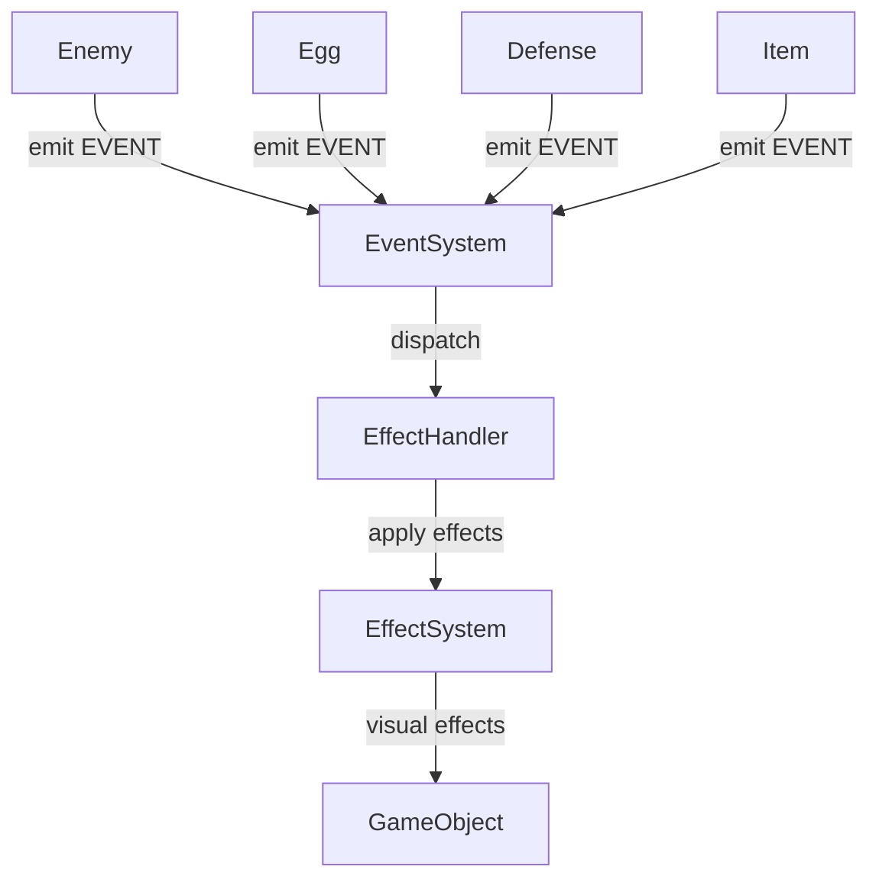

# 🎯 Event-Driven Architecture (EDA) в Telepets Mini Games

## 📋 Обзор

Event-Driven Architecture (EDA) - это архитектурный паттерн, который использует события для связи между компонентами системы. В нашем проекте EDA позволяет декомпозировать игровую логику и визуальные эффекты, делая код более модульным и расширяемым.

## 🏗️ Архитектура

### Основные компоненты:

```
src/
├── types/
│   └── EventTypes.js      # Константы типов событий
├── systems/
│   └── EventSystem.js     # Центральный диспетчер событий
├── handlers/
│   └── EffectHandler.js   # Обработчик эффектов
└── objects/
    └── Enemy.js           # Объекты, отправляющие события
```

### Схема взаимодействия:



## 🎮 Типы событий

### События врагов:
- `ENEMY_SPAWN` - Появление врага
- `ENEMY_DAMAGE` - Получение урона
- `ENEMY_DEATH` - Смерть врага
- `ENEMY_ATTACK` - Атака врага
- `ENEMY_TARGET_CHANGED` - Смена цели

### События яйца:
- `EGG_CREATE` - Создание яйца
- `EGG_DAMAGE` - Урон яйца
- `EGG_HEAL` - Лечение яйца
- `EGG_DESTROYED` - Уничтожение яйца

### События предметов:
- `ITEM_SPAWN` - Появление предмета
- `ITEM_COLLECT` - Сбор предмета
- `ITEM_DESTROY` - Уничтожение предмета

### События защиты:
- `DEFENSE_CREATE` - Создание защиты
- `DEFENSE_ACTIVATE` - Активация защиты
- `DEFENSE_REPAIR` - Ремонт защиты
- `DEFENSE_DESTROY` - Уничтожение защиты

### События игрового процесса:
- `GAME_START` - Начало игры
- `GAME_END` - Окончание игры
- `GAME_PAUSE` - Пауза
- `GAME_RESUME` - Продолжение

## 💻 Использование

### 1. Инициализация в сцене:

```javascript
import { EventSystem } from '../systems/EventSystem.js';
import { EffectHandler } from '../handlers/EffectHandler.js';

class GameScene extends Phaser.Scene {
    initGameSystems() {
        // Создаем центральную систему событий
        this.eventSystem = new EventSystem();
        
        // Создаем обработчик эффектов
        this.effectHandler = new EffectHandler(this, this.eventSystem);
        
        // Инициализируем в игровых объектах
        Enemy.initEventSystem(this.eventSystem);
    }
}
```

### 2. Отправка событий из объектов:

```javascript
// В классе Enemy
takeDamage(damage) {
    super.takeDamage(damage);
    
    // Отправляем событие
    if (Enemy.eventSystem) {
        const intensity = damage / this.maxHealth;
        Enemy.eventSystem.emit(EVENT_TYPES.ENEMY_DAMAGE, {
            enemy: this,
            damage: damage,
            intensity: Math.min(intensity, 1.0)
        });
    }
}
```

### 3. Обработка событий:

```javascript
// В EffectHandler
handleEnemyDamage(data) {
    const { enemy, damage, intensity = 1.0 } = data;
    
    // Применяем эффекты
    this.effectSystem.applyEffect('shake', enemy, intensity, {
        duration: 200,
        intensity: 5 + (damage * 0.5)
    });
    
    this.effectSystem.applyEffect('flicker', enemy, intensity, {
        duration: 300,
        repeat: 2
    });
}
```

## 🔧 API EventSystem

### Основные методы:

```javascript
// Подписка на событие
eventSystem.on(EVENT_TYPES.ENEMY_DAMAGE, callback, context);

// Подписка на одноразовое событие
eventSystem.once(EVENT_TYPES.GAME_START, callback, context);

// Отправка события
eventSystem.emit(EVENT_TYPES.ENEMY_DEATH, { enemy: this });

// Отписка от события
eventSystem.off(EVENT_TYPES.ENEMY_DAMAGE, callback, context);

// Очистка всех слушателей
eventSystem.clear();
```

### Статистика:

```javascript
// Получение статистики
const stats = eventSystem.getStats();
console.log('Всего событий:', stats.totalEvents);
console.log('Всего слушателей:', stats.totalListeners);
console.log('Активные события:', stats.activeEvents);
```

## 🎨 Преимущества EDA

### 1. **Декомпозиция:**
- Игровая логика отделена от визуальных эффектов
- Легко добавлять новые типы событий
- Компоненты не зависят друг от друга напрямую

### 2. **Расширяемость:**
- Новые обработчики можно добавить без изменения существующего кода
- Легко создавать новые типы эффектов
- Простое добавление логирования, аналитики и т.д.

### 3. **Тестируемость:**
- Каждый компонент можно тестировать изолированно
- Легко мокать события для тестов
- Четкое разделение ответственности

### 4. **Производительность:**
- События обрабатываются асинхронно
- Можно оптимизировать обработку событий
- Легко добавить кеширование или батчинг

## 🚀 Примеры использования

### Добавление нового события:

1. **Добавляем константу в EventTypes.js:**
```javascript
export const EVENT_TYPES = {
    // ... существующие события
    POWERUP_COLLECT: 'powerup:collect'
};
```

2. **Отправляем событие в объекте:**
```javascript
collectPowerup(powerup) {
    // ... логика сбора
    
    if (GameObject.eventSystem) {
        GameObject.eventSystem.emit(EVENT_TYPES.POWERUP_COLLECT, {
            player: this,
            powerup: powerup,
            effect: powerup.effect
        });
    }
}
```

3. **Обрабатываем в EffectHandler:**
```javascript
setupEventListeners() {
    // ... существующие слушатели
    this.eventSystem.on(EVENT_TYPES.POWERUP_COLLECT, this.handlePowerupCollect.bind(this));
}

handlePowerupCollect(data) {
    const { player, powerup, effect } = data;
    
    // Применяем эффект
    this.effectSystem.applyEffect(effect, player, 1.0);
    
    // Добавляем частицы
    this.effectSystem.applyEffect('collectParticles', player, 1.0);
}
```

### Создание нового обработчика:

```javascript
// src/handlers/AudioHandler.js
export class AudioHandler {
    constructor(scene, eventSystem) {
        this.scene = scene;
        this.eventSystem = eventSystem;
        this.setupEventListeners();
    }
    
    setupEventListeners() {
        this.eventSystem.on(EVENT_TYPES.ENEMY_DEATH, this.handleEnemyDeath.bind(this));
        this.eventSystem.on(EVENT_TYPES.ENEMY_ATTACK, this.handleEnemyAttack.bind(this));
    }
    
    handleEnemyDeath(data) {
        this.scene.sound.play('enemy_death');
    }
    
    handleEnemyAttack(data) {
        this.scene.sound.play('enemy_attack');
    }
}
```

## 🔍 Отладка

### Логирование событий:

```javascript
// В EffectHandler
setupEventListeners() {
    // Логируем все события для отладки
    this.eventSystem.on('*', (eventType, data) => {
        console.log(`Event: ${eventType}`, data);
    });
}
```

### Статистика в реальном времени:

```javascript
// В игровом цикле
update() {
    if (this.time.now % 5000 < 16) { // Каждые 5 секунд
        const stats = this.eventSystem.getStats();
        console.log('Event System Stats:', stats);
    }
}
```

## 📝 Лучшие практики

### 1. **Именование событий:**
- Используйте формат `category:action`
- Будьте конкретными в названиях
- Избегайте аббревиатур

### 2. **Структура данных событий:**
- Всегда передавайте объект с данными
- Включайте контекстную информацию
- Используйте консистентные имена полей

### 3. **Обработка ошибок:**
- Всегда проверяйте существование EventSystem
- Обрабатывайте ошибки в обработчиках
- Логируйте проблемы

### 4. **Производительность:**
- Не отправляйте события в каждом кадре
- Используйте debouncing для частых событий
- Очищайте слушатели при уничтожении объектов

## 🎯 Заключение

Event-Driven Architecture значительно улучшает архитектуру проекта, делая код более модульным, тестируемым и расширяемым. Система событий позволяет легко добавлять новые функции и эффекты без изменения существующего кода.

### Следующие шаги:
1. Добавить события для других игровых объектов (Egg, Defense, Item)
2. Создать дополнительные обработчики (AudioHandler, AnalyticsHandler)
3. Добавить систему приоритетов для событий
4. Реализовать отмену событий
5. Добавить систему фильтрации событий
